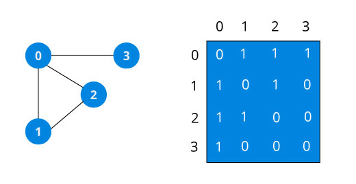
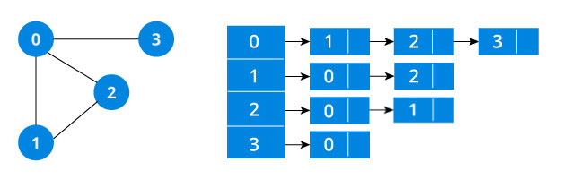

图是非常重要的数据结构，现实中的很多问题都归结于图的问题，这里我们讨论一下图，关于图的基础：顶点、边等概念可参考文档：[Graph Data Stucture](https://www.programiz.com/dsa/graph)，这里不再细述。

### 图的表示
图有两种表示方法：邻接矩阵、邻接链表。不同的场景及算法可能需要不同的图表示方式，一般情况下当结点数量非常庞大时，会造成矩阵非常稀疏，空间开销会较大，此时使用邻接链表的表示方式会占用较少的空间。而如果是稠密矩阵或者需要快速判断任意两个结点是否有边相连等情况，可能邻接矩阵更合适。

#### 邻接矩阵

```c++
#include<iostream>
using namespace std;

// 无向有权图
class Graph {
public:
    Graph(int numVertices) {
        this->numVertices = numVertices;
        matrix = new int*[numVertices];
        for (int i = 0; i < numVertices; ++i) {
            matrix[i] = new int[numVertices];
            for (int j = 0; j < numVertices; ++j) {
                matrix[i][j] = 0;
            }
        }
    }

    void addEdge(int v1, int v2, int value = 1) {
        matrix[v1][v2] = value;
        matrix[v2][v1] = value;
    }

    void removeEdge(int v1, int v2) {
        matrix[v1][v2] = 0;
        matrix[v2][v1] = 0;
    }

    bool isEdge(int v1, int v2) {
        return matrix[v1][v2] != 0 ? true : false ;
    }

    void print() {
        for (int i = 0; i < numVertices; ++i) {
            cout << i << " : ";
            for (int j = 0; j < numVertices; ++j) {
                cout << matrix[i][j] << " ";
            }
            cout << endl;
        } 
    }

    ~Graph() {
        for (int i = 0; i < numVertices; ++i) {
            delete[] matrix[i];
        }

        delete[] matrix;
    }

private: 
    int **matrix;
    int numVertices;
};
```

#### 邻接链表

```c++
#include<iostream>
#include<list>
using namespace std;

//有向无权图
class Graph {
public:
    Graph(int numVertices) {
        this->numVertices = numVertices;
        adjLists = new list<int>[numVertices];
    }

    void addEdge(int src, int dst) {
        adjLists[src].push_back(dst);
    }

    void removeEdge(int src, int dst) {
        adjLists[src].remove(dst);
    }

    void print() {
        for (int i = 0; i < numVertices; ++i) {
            cout << i << " : ";
            for (auto it = adjLists[i].begin(); it != adjLists[i].end(); ++it) {
                cout << *it << " ";
            }
            cout << endl;
        }
    }

    ~Graph() {
        delete[] adjLists;
    }
private:
    list<int> *adjLists;
    int numVertices;
};
```

### 图的遍历
遍历分两种，深度优先与广度优先。在遍历时结点有两种状态：已访问、未访问，这样如果一个结点在遍历过程中已访问的话就可以避免再次访问。

#### 深度优先遍历
深度优先算法的过程如下：
1. 可从任意一个顶点开始，将之放入栈中。
2. 从栈顶弹出一个顶点，放入已访问列表中。
3. 将刚刚弹出的顶点的未访问过的邻接结点放入栈中。
4. 重复步骤2、3直到栈为空为止。
```c++
    void depthFirstSearch(int vertex) {
        bool visited[this->numVertices];
        for (auto i = 0; i < this->numVertices; ++i) {
            visited[i] = false;
        }

        stack<int> m_stack;
        m_stack.push(vertex);
        while (!m_stack.empty()) {
            auto v = m_stack.top();
            if (visited[v]) {
                m_stack.pop();
                continue;
            }

            visit(v);
            visited[v] = true;
            m_stack.pop();
            
            for (auto it = this->adjLists[v].begin(); it != this->adjLists[v].end(); ++ it) {
                if (!visited[*it]) {
                    m_stack.push(*it);
                }
            }
        }
    }
```

#### 广度优先遍历
广度优先遍历的步骤如下：
1. 可从任意一个顶点开始，将之放入队列中。
2. 从队列首部弹出一个顶点，放入已访问列表中。
3. 将刚刚弹出的顶点的未访问过的邻接结点放入队列尾部。
4. 重复步骤2、3直到队列为空为止。
```c++
    void breadthFirstSearch(int vertex) {
        bool visited[this->numVertices];
        for (auto i = 0; i < this->numVertices; ++i) {
            visited[i] = false;
        }

        queue<int> m_queue;
        m_queue.push(vertex);
        while(!m_queue.empty()) {
            auto v = m_queue.front();
            if (visited[v]) {
                m_queue.pop();
                continue;
            }

            visit(v);
            visited[v] = true;
            m_queue.pop();

            for (auto it = this->adjLists[v].begin(); it != this->adjLists[v].end(); ++it) {
                if (!visited[*it]) {
                    m_queue.push(*it);
                }
            }
        }
    }
```
