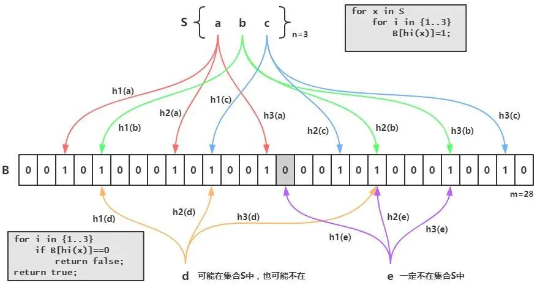
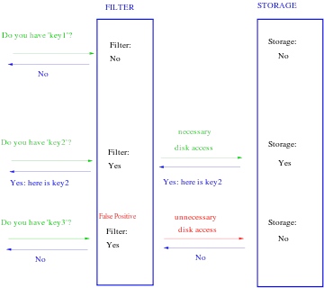

### 提出一个问题 
在我们细述Bloom过滤器之前，我们先抛出一个问题：给你一个巨大的数据集（百万级、亿级......），怎么判断一个元素是否在此数据集中？或者怎么判断一个元素不在此数据集中？

思考这个问题的时候，最先想到的可能是哈希表，在数据集规模较小的时候，这个方法是可行的，当然，数据集巨大的时候也可以采用分布式哈希表的方式。当数据集规模较大时，尤其是应用中只需要判断一个元素不在此数据集中的情况时，我们可以借鉴哈希表的思路，使用Bloom过滤器解决这个问题。既然我们只关心元素在不在，不关心元素值是什么，只要把元素映射为一个布尔值表示在不在就足够了。下面细述Bloom过滤器数据结构的设计。

### Bloom过滤器数据结构
Bloom filter(布鲁姆过滤器)是用于测试元素成员资格的空间高效概率数据结构。数据结构以牺牲规定的假阳性率为代价实现了巨大的数据压缩。一个Bloom过滤器作为一个`m`位的数组全部设置为`0`。选择一组`k`个随机散列函数，在Bloom过滤器中添加元素时，元素将分别进行哈希散列，而对于每个`k`个输出，该索引处的相应的Bloom过滤器位将被设置为`1`。通过使用与之前相同的散列函数来完成Bloom过滤器的查询。如果在bloom过滤器中访问的所有`k`个比特被设置为`1`，则这很可能表明该元素位于该集合中。删除元素只能通过废除Bloom过滤器并从头重新创建来完成，这个问题后面会讨论到。

Bloom过滤器是由底层数组和哈希函数组合在一起工作的，根据对误报率要求的不同，可以选择一个哈希函数，也可以选2个、3个，一般情况下选3个。与哈希表不同，为节省空间，Bloom过滤器的底层数组的每一位是一个比特，`1`表示有映射，`0`表示无映射。数组的长度与问题规模、哈希函数、误报率等因素有关，根据数据集规模的不同，可选用适当的哈希函数与适合的数组大小。因为具体问题的不同，很难说那种实现是最好的。下面举例说明Bloom过滤器的工作过程。

数据集`s={a,b,c}`，底层数组长度`m=28`，初始值全部为`0`，哈希函数个数`k=3`，分别为`h1`、`h2`和`h3`。

首先遍历数据集中的元素，对每个元素分别计算3组哈希，将数组中对应位置置为`1`。计算过程中，有可能会发生哈希碰撞（即，不同元素的哈希值映射到数组中同一个位置），此时置`1`即可，与哈希表不同，无需做冲突处理。所有元素插入后，Bloom过滤器构造完成。

构造好Bloom过滤器后，我们开始判断一个元素是否在数据集中。我们对要判读的元素做3次哈希，在数组中找对应位置的映射值，如果发现有一个映射值为`0`，那么可以判断该元素一定不在数据集中，如果数组中对应的哈希映射值全部是`1`，则可以判断大概率在数据集中，但也有可能不在数据集中。后面会给出原因。例如图中的元素`e`，经过哈希映射后，发现有一个映射值为`0`，则，元素`e`不在数据集中；而元素`d`，虽然哈希映射值全部为`1`，但只是大概率在数据集中，实际上却不在数据集中，当然这种误判发生的概率很低。

可以看到，Bloom过滤器的工作过程是非常简单的。

### Bloom过滤器的相关问题
#### 为什么Bloom过滤器不能100%确定元素在数据集中呢？
很明显，Bloom过滤器是可以100%确定一个元素不在数据集中的，但是判断一个元素在数据集中只能说很大概率在。

因为哈希碰撞的原因，底层数组对应映射值为`1`，有可能是其他元素与要查找的元素发生碰撞，实际上，该元素并不存在在数据集中。所以Bloom过滤器存在误报率。

#### Bloom过滤器能否有删除元素的操作

可以看到，Bloom过滤器，只有插入、查找操作，没有删除操作，为什么呢？

因为哈希碰撞的原因，有可能2个元素发生哈希碰撞，此时删掉其中一个元素，对应底层数组的值置为`0`，则等于把另一个元素也删掉了，所以是没有删除操作的。那单从数据集中删掉一个元素，对应的底层数组的值不变，这样可以吗？逻辑上，是可以的，并不会引发错误，但实际上，这样做会大幅增加误报率，如果不断的删除插入，最后会发现，整个底层数组都快被填满了，失去了Bloom过滤器快速判断元素是否在数据集中的意义了。当然，如果删除操作很少的话，这样解决也是可以的，但是要在误报率允许范围内，定期重建Bloom过滤器（当数据集非常大时，不断重建的过程代价是很大的）。

当然，现实需求中，很可能是有删除元素的操作需求的，哪怎么办呢？可能的一个思路是在Bloom过滤器的基础上，做改进，类似引用计数的思路，底层数组中的值不再是布尔值，而是一个整型，每当发生一次碰撞，对应值递增一次，当删除一个元素时，递减一次。当然仅仅做到这样，还是不够的，可能还会有其他的问题，具体怎么实现，还有待各位大神去解决，这里不再做更深的思考。

还有大神提出了Cuckoo Filter，参考论文[Cuckoo Filter: Practically Better Than Bloom](https://www.cs.cmu.edu/~dga/papers/cuckoo-conext2014.pdf)。

#### 误报率的计算
误报率与多个因素相关，数组的长度，元素的个数，哈希函数本身，哈希函数的个数等等。对于误报率如何计算，可参考[Bloom filter](https://en.wikipedia.org/wiki/Bloom_filter)，这里不再细述。
>参考文档：[布隆过滤器](https://zhuanlan.zhihu.com/p/31498003)

除了理论上的误报率计算，程序也可以实际感受到误报率的变化，需要的话可以在程序中对每一次误报做统计，`误报的次数/总的次数`。

### Bloom过滤器的应用
经过上面的学习，我们可以回答文章最开始的问题了，只需要将原始数据集全部映射到Bloom过滤器底层数组中，所需要的空间开销要比哈希表等其他方式小的多，因为它不存储原始数据集数据，只存储象征数据是否存在的一个布尔值。判断一个元素时，计算哈希，查找对应映射值即可判断。

下图说明的是在一个KV存储系统中，使用Bloom提高查询响应速度。

可以看到，针对`key1`这种查询请求，就无需再访问KV存储系统了，可返回访问结果：数据不存在；针对`key2`这种请求，则继续访问KV存储系统返回结果；针对`key3`这种是属于误报，很少发生。如果实际的应用需求中，有大量的系统并未实际存储的数据查询请求，这种方式能够显著降低对KV存储系统的访问，提高响应效率。

