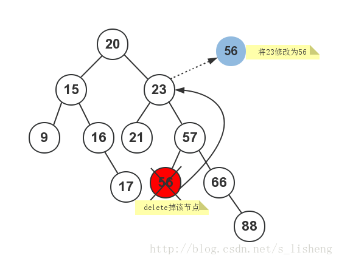

### 一、树的相关概念
- 空树：是高度为0的合法树；
- 单一节点：是高度为1的树（是节点既是根也是叶子的唯一情况）；
- <u>极端情况下，树退化为链表</u>；（比如二叉查找树中，数据正好是已经排好序的，此时数据元素全部位于左子树或右子树，相当于链表结构）
- 二叉树：节点可以包含两个子节点（也可能为空）的树，每一个子节点都区分为左子节点或右子节点。
- 完全二叉树：所有的非终端节点都有两个子节点，所有的叶节点都位于同一层次；
- 对于非空二叉树，若其所有的非终端节点刚好有两个非空子节点，则叶节点的数目`m`大于非终端节点的数目`k`，并且`m=k+1`；
- <u>二叉查找树（有序二叉树）：对于树中的每个节点n，其左子树（根节点为左子节点的树）中的值小于节点n中的值v，其右子树中的值大于节点n中的值v。</u>

### 二、二叉树的实现
二叉树至少可以有两种方式实现：数组和链接结构。这里使用链接结构实现。

二叉查找树的性质：
- 对于树中的每个节点X，它的左子树中所有项的值都要小于X中的项；
- 对于树中的每个节点Y，它的右子树中所有项的值都要大于Y中的项。

下面我们详细介绍通用二叉查找树的实现。其中，插入、查找等操作较为简单，这里不再描述。

#### 删除操作
删除操作要麻烦一点，因为要考虑删掉元素后空的位置需要再新添一个元素，不然，如果删除的不是叶子节点的话树结构就被破坏了。`remove`函数用来删除二叉查找树中指定的元素值。在删除子节点时，需要分以下几种情况进行考虑：
1. 需要删除的子节点，它没有任何子节点；例如图中的节点9、节点17、节点21、节点56和节点88；这些节点它们都没有子节点；
2. 需要删除的子节点，只有一个子节点（只有左子节点或右子节点）；例如图中的节点16和节点40；这些节点它们都只有一个子节点；
3. 需要删除的子节点，同时拥有两个子节点；例如图中的节点66等。


##### 复制删除
首先介绍的是复制删除的思路，即从树中另选择一个节点代替被删除节点的值，再将被选择的那个节点删除。具体如下：
- 对于情况1，直接删除对应的节点即可；实现起来时比较简单的；
- 对于情况2，直接删除对应的节点，然后用其子节点占据删除掉的位置；
- 对于情况3，是比较复杂的。有2种方法，选择哪一种方法都可以：
    - 其一，（选择右子树中最小值节点）首先在需要被删除节点的右子树中找到最小值节点，然后使用该最小值替换需要删除节点的值，然后在右子树中删除该最小值节点。
    - 其二，（选择左子树中最大值节点）在需要被删除节点的左子树中找到最大值节点，然后使用该最大值替换需要删除节点的值，然后在左子树中删除该最大值节点。
```c++
template<class T>
void BST<T>::deleteByCopying(BSTNode<T>*& node) {    
    BSTNode<T> *previous, *tmp = node;
     if (node->right == 0)                  // node has no right child;
          node = node->left;
     else if (node->left == 0)              // node has no left child;
          node = node->right; 
     else {
          tmp = node->left                  // node has both children;
          previous = node;                  // 1. 这里采用的是选择选择左子树中的最大值节点的方法
          while (tmp->right != 0) {         // 2. 找左子树中的最大值节点
              previous = tmp;
              tmp = tmp->right;
          }
          node->el = tmp->el;               // 3.将左子树中的最大值节点的值赋值给被删除节点的元素值
          // 处理删除被选择的节点
          if (previous == node)             // 如果左子树最大值节点的父节点为被删除节点的话，将被选择的节点（左子树最大值节点）左子树上移
               previous->left  = tmp->left;
          else previous->right = tmp->left; // 4. 如果左子树最大值节点的父节点不是被删除节点的话，将被选择的节点（左子树最大值节点）的左子树的父节点设置为被选择节点的前驱节点的右子节点
     }
     delete tmp;                            // 5.
}
```
上面的代码不好理解的话，下面这段代码会好理解一下，也可以看下面这段代码，作用是一样的。
```c++
// 这里采用的方法一，选择右子树中最小值节点
template<class T>
void BST<T>::remove(const T& x, Node<T>* &t) const {
	if(NULL == t)
		return;
	// 移除一个节点稍微麻烦一点，因为移除一个节点后二叉树需要将移除的位置再填一个节点过去
	if(x < t->data) {
		remove(x, t->left);
	} else if(x > t->data) {
		remove(x, t->right);
	} else if(t->left != NULL && t->right != NULL) {
		//拥有2个子节点
		t->data = findMin(t->right)->data;	//当前元素用右子树最小值填充
		remove(t->data, t->right);		//填充值被移走了，需要删除原填充值
	} else if(t->left == NULL && t->right == NULL) {
		//没有子节点，最简单的情况，直接删掉
		delete t;
		t = NULL;
	} else if(t->left == NULL || t->right == NULL) {
		//拥有一个子节点
		Node<T>* p = t;
		t = (t->left != NULL)?t->left:t->right;//用其子节点占据删除掉的位置；
		delete p;//直接删除对应的节点
	}
}

//删除指定元素
template<class T>
void BST<T>::remove(const T& x) {
	remove(x, root);
}
```
##### 合并删除
当然，删除操作也不止这一种解决思路，还有一种合并删除的思路——<u>从被删除节点的两颗子树中合并为一颗，然后将这颗树连接到被删除节点的父节点处。</u>

也同样分3种情况处理：
- 被删除的节点为叶子节点，直接删除即可；
- 被删除的节点只有左子树或者右子树，直接将其左子树或右子树上移即可；
- 被删除的节点有左子树和右子树，同样有两种方法：
    - 将被删除节点的整颗右子树合并到左子树的最大值节点后面形成一个新的子树（找到左子树中最大值节点，使它成为右子树的父节点），将新的子树连接到被删除节点的父节点。
    - 将被删除节点的整颗左子树合并到右子树的最小值节点后面形成一个新的子树（找到右子树中最小值节点，使它成为左子树的父节点），将新的子树连接到被删除节点的父节点。
```c++
template<class T>
void BST<T>::deleteByMerging(BSTNode<T>*& node) {   
    BSTNode<T> *tmp = node;
    if (node != 0) {
        // 只有右子树或左子树的情况
        if (!node->right)           // node has no right child: its left
             node = node->left;     // child (if any) is attached to its parent;
        else if (node->left == 0)   // node has no left child: its right
             node = node->right;    // child is attached to its parent;
        else {                      // be ready for merging subtrees;
             // 将被删除节点的整颗右子树合并到被删除节点的左子树的最大节点处
             tmp = node->left;      // 1. move left
             while (tmp->right != 0)// 2. and then right as far as possible;
                tmp = tmp->right;
             tmp->right =           // 3. establish the link between the
                node->right;        //    the rightmost node of the left
                                    //    subtree and the right subtree;
             tmp = node;            // 4.
             node = node->left;     // 5. 新的子树代替原有被删除节点的位置，链接到被删除节点的父节点
        }
        delete tmp;                 // 6.
     }
}
```
对比复制删除与合并删除这两种思路，复制删除操作不会增加树的高度，而合并删除则可能会增加树的高度。

#### 遍历操作
遍历操作方法有深度优先和广度优先两大类，其中深度优先遍历中又有前序、中序、后序等遍历方法。
##### 广度优先遍历
```c++
//广度优先遍历（从上到下，从左到右，一层一层的向下访问）
template<class T>
void BST<T>::breadthFirst() {
	Queue<Node<T>*> m_queue;	//要理解这里为什么要用队列，这个队列的作用是把下一层的数据放到本层数据的后面
	Node<T>* p = root;
	if (p != NULL) {
		m_queue.enqueue(p);
		while (!m_queue.empty()) {
			p = m_queue.dequeue();
			visit(p);
			if (p->left != NULL)
				m_queue.enqueue(p->left);
            if (p->right != NULL)
				m_queue.enqueue(p->right);
		}
	}
}
```

##### 深度优先遍历
- 前序遍历——节点->左子树->右子树；
- 中序遍历——左子树->节点->右子树；<font color=blue>这里补充一条：二叉查找树的中序遍历，即是二叉查找树节点从小到大的排序结果；</font>
- 后序遍历——左子树->右子树->节点；

遍历方法有递归实现、利用栈实现、线索树实现、Morris算法等方式，详细实现见代码：

```c++
//中序遍历，递归实现
template<class T>
void BST<T>::inorder(Node<T> *p) {
	if (p != NULL) {
		inorder(p->left);
		visit(p);
		inorder(p->right);
	}
}

//前序遍历，递归实现
template<class T>
void BST<T>::preorder(Node<T> *p) {
	if (p != NULL) {
		visit(p);
		preorder(p->left);
		preorder(p->right);
	}
}

//后续遍历，递归实现
template<class T>
void BST<T>::postorder(Node<T>* p) {
	if (p != NULL) {
		postorder(p->left);
		postorder(p->right);
		visit(p);
	}
}
```
递归实现是非常容易理解的，下面是非递归实现。
```c++
//前序遍历，非递归实现
template<class T>
void BST<T>::iterativePreorder() {
    Stack<Node<T>*> m_stack;
    Node<T>* p = root;
    if (p != NULL) {
        m_stack.push(p);//从跟节点开始压
        while (!m_stack.empty()) {
            p = m_stack.pop();
            visit(p);
            if (p->right != NULL)//先压右子节点再压左子节点，因为要左侧先出
                m_stack.push(p->right);
            if (p->left != NULL) // left child pushed after right
                m_stack.push(p->left);
        }
    }
}

//后序遍历，非递归实现
template<class T>
void BST<T>::iterativePostorder() {
	Stack<Node<T>*> m_stack;
	Node<T>* p = root, *q = root;
	while (p != NULL) {
		for (; p->left != NULL; p = p->left)
			m_stack.push(p);
		while (NULL == p->right || q == p->right) {
			visit(p);
			q = p;
			if (m_stack.empty())
				return;
			p = m_stack.pop();
		}
		m_stack.push(p);
		p = p->right;
	}
}

//中序遍历，非递归实现
template<class T>
void BST<T>::iterativeInorder() {
	Stack<Node<T>*> m_stack;
	Node<T>* p = root;
	while (p != NULL) {
		while (p != NULL) {                 // stack the right child (if any)
			if (p->right)                // and the node itself when going
				m_stack.push(p->right); // to the left;
			m_stack.push(p);
			p = p->left;
		}
		p = m_stack.pop();             // pop a node with no left child
		while (!m_stack.empty() && p->right == NULL) { // visit it and all nodes
			visit(p);                                 // with no right child;
			p = m_stack.pop();
		}
		visit(p);                        // visit also the first node with
		if (!m_stack.empty())          // a right child (if any);
			p = m_stack.pop();
		else p = NULL;
	}
}
```

#### 查找最大值与最小值
根据二叉查找树的性质：
- 对于树中的每个节点X，它的左子树中所有项的值都要小于X中的项；
- 对于树中的每个节点Y，它的右子树中所有项的值都要大于Y中的项。

我们可以从root节点开始：
- 一直沿着左节点往下找，直到子节点等于NULL为止，这样就可以找到最小值了；
- 一直沿着右节点往下找，直到子节点等于NULL为止，这样就可以找到最大值了。

如下图所示：


完整代码[bstree.h](./bstree.h)