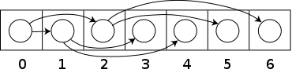

### 堆
堆是一种特别的树状数据结构。若满足以下特性，即可称为堆：“给定堆中任意节点P和C，若P是C的父节点，那么P的值会小于等于（或大于等于）C的值”。若父节点的值恒小于等于子节点的值，此堆称为最小堆；反之，称为最大堆。

通常最用的是二叉堆，为二叉树的一种，有以下性质：
- 任意节点小于等于（或大于等于）它的子节点，最小元（或最大元）在堆的根上。
- 堆总是一颗完全树。即除了最底层，其他层的节点都被元素填满，且最底层从左到右填入。      
  

可以看到，二叉堆是一种部分排序，只对父子节点的排序做了限制，对左右子节点的大小排序则没有做限制。我们看一下堆的具体实现。

### 堆的实现
因为堆总是一颗完全树，所以其存储可以用数组（变长数组）来表示。用数组表示的非常大的好处是能快速定位一个节点在堆中的位置。根节点在数组中的下标可以从0开始，也可以从1开始，这里从1开始。当一个元素在数组中的位置为`i`时，其左子节点`left = 2i`，右子节点`right = 2i + 1`，相应的其父节点`parent = [i / 2]`（[]表示取整）。这个是可以推导出来的。推导思路如下：
其实上面三个公式，只要推导出`left = 2i`，其他两个很自然就推导出来了。而推导左子节点的思路，假定节点`i`在堆的第`l`层的第`j`个节点，有`left = 2^(l-1) + j-1`，  则左子节点`sub_left`就在堆的第`l+1`层的第`2(j-1) + 1 - 1`的位置上，即`sub_left = 2^l + 2(j-1)`，可以看到`sub_left = 2 * left`，推导完毕。

       
#### 插入
插入的实现思路： 主要从堆的性质去考虑怎么实现，堆总是一颗完全树，所以，新插入的节点为满足完全树的性质要放到树叶子节点空闲的最左节点，但这样可能不满足父节点总大于等于子节点的要求，所以，还要判断，如果大于父节点，就上移，直到满足小于父节点的条件。算法描述如下：
1. Add the element to the bottom level of the heap at the most left.
2. Compare the added element with its parent; if they are in the correct order, stop.
3. If not, swap the element with its parent and return to the previous step.

      
      
      


时间复杂度，最坏情况`O(log(n))`，最好情况很简单就是`O(1)`。

#### 删除根节点
删除根节点的实现思路： 与插入类似，堆要删除一个节点（根节点），还要满足是完全树，只能是“删除”最右测的叶子节点，将该节点复制到根节点，但此时虽满足完全树却不满足父节点大于子节点的性质，因此，要不断将该节点下移，直到满足父节点大于子节点。算法描述如下：
1. Replace the root of the heap with the last element on the last level.
2. Compare the new root with its children; if they are in the correct order, stop.
3. If not, swap the element with one of its children and return to the previous step. (Swap with its smaller child in a min-heap and its larger child in a max-heap.)

       
                  
                   

#### 堆的构造
构造一个堆，最简单的方法就是一个元素一个元素的插入到堆中，在最坏的情况下，插入n个元素的时间复杂度为`log(1) + log(2) + ... + log(n) = log(1 * 2 * ... * n) = log(n!)=O(nlog(n))`。这种方法也被称为是自顶向下式的，还有另一种自底向上构造的方法，可以将一个数组转换为堆，时间复杂度可以做到`O(n)`。

具体方法是从一个节点元素任意放置的二叉树开始（表示形式为一个没有堆性质的数组），自底向上堆每个子树执行“下移”操作，先构造较小的堆，再将他们重复合并成很大的堆。

下移操作(即下移元素i直到满足父节点大于等于子节点这个堆性质)算法描述如下：
```
Max-Heapify (A, i):
    left = 2*i
    right = 2*i+1
    largest = i

    if left <= heap_length[A] and A[left] > A[largest] then:
        largest = left
    
    if right <= heap_length[A] and A[right] > A[largest] then:
        largest = right
    
    if largest != i then:
        swap(A[i], A[largest])
        Max-Heapify (A, largest)
```
构造堆的算法描述如下：
```
Build-Max-Heap (A):
    heap_length[A] = length[A]
    // 这块其实就是对二叉树中所有非叶子节点进行“下移”操作，从最底层向最上构造堆
    for each index i from floor(length[A]/2) downto 1 do:
        Max-Heapify (A, i) 
```
>这个构造堆的算法的时间复杂度分析比较复杂一些，具体的分析可参考[Building a heap](https://en.wikipedia.org/wiki/Binary_heap)，这里说一下分析的思路：分析这个时间复杂度，我们知道一次“下移”操作的时间复杂度是`O(h)`，时间复杂度与树高度有关，然后分析每一层的时间复杂度，再分析每一层最多有多少个节点，最后将所有层累加起来就得到了，式子比较复杂，还需要级数化简等步骤。

### 堆的设计逻辑
堆这种数据结构，主要的设计逻辑是什么呢？如果让你自己实现一个优先队列或者实现一种满足首部一直保持最大（或最小）值，并且要满足push、pop，每次pop都是首部的最大（或最小值），你会怎么设计呢？我想设计思路一定不止一种，你可以用有序链表（可以是最从小到大排序或是从大到小排序）实现，每次在链表尾部插入数据，然后将这个数据移动到其有序的位置，这样可以保持首部一直是最大值（或最小值），时间复杂度为`O(n)`。有没有更好一点的呢？时间复杂度可不可以再降一点呢？我们想可不可以由`O(n)`降到`O(log(n))`呢？我们很容易联想到用红黑树或者跳跃链表，用红黑树实现，push操作时，与正常插入无异，pop操作时，每次取左子树的最末端，或者右子树的最末端，可以看到，push时需要`O(log(n))`，pop时还需要`O(log(n))`，其中还有旋转、颜色变换等没有计算在内。跳跃链表实现要稍好一些，跳跃链表一定程度上可以看作是平躺着的二叉搜索树，push时是`O(log(n))`，pop时是`O(1)`，当然还有删除首部元素时，找到首元素是`O(1)`，但具体删除时类似链表删除，区别是需要删除多层链表，所以更准确一点应该是大于`O（1）`，小于`O(log(n))`，但问题是，跳跃链表的空间消耗比较大。有没有更好的呢？其实没有必要用这么重型的树，无论是AVL树、红黑树还是跳跃链表，都花了一定代价去维持树的平衡，我可不可以直接维持平衡的完全二叉树呢？树直接就是平衡的，不需要花代价进行平衡操作，因为只关心首部元素的大小，我还有必要维护二叉查找树的左子树小于右子树的性质吗？联想一下自适应链表或自适应树的思路，我们可以把优先级高的元素放到更靠近树的根部，具体的做法就是父节点的优先级要高于子节点的优先级，这样，这两点就构成了堆的数据结构，是一种非常优秀，实现代价很低，占用空间很少的数据结构。

### 堆的应用
说道堆的应用，最常见的就是优先队列的实现了,把堆稍微封装一下就可以实现优先队列了。见代码[heap.h](./heap.h)。

其他的还有堆排序，在图论中等等其他方面的应用，这里不再列出。


---

>Reference:
[Heap (data structure)](https://en.wikipedia.org/wiki/Heap_(data_structure))        
[Binary heap](https://en.wikipedia.org/wiki/Binary_heap)      