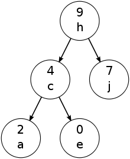

### 树堆
树堆，是一种将二叉查找（搜索）树与堆两种数据结构结合在一起的一种数据结构，它首先是一颗二叉查找树同时满足一定的堆性质。我们知道二叉查找树与堆性质是有矛盾的，解决办法就是元素值以二叉查找树的性质分布，每个元素插入时都会随机生成一个优先级，优先级要满足堆性质中父节点大于等于子节点的性质，但不要求满足完全二叉树的堆性质。这样做的好处是：使二叉查找树保持一定的平衡性。      
       
### 树堆的实现
树堆的实现，主要是堆怎么融到二叉查找树中，我们知道维护堆性质，需要经常交换父子节点的值，这里如果直接交换会破坏二叉查找树的性质，怎么办呢？用旋转的方法，交换父子节点的值不是目的，目的是维护堆父节点大于子节点的性质，用旋转的方法同样等做到这一点，同时还保证了二叉查找树的性质。

#### 查找
查找的过程与二叉查找树的查找过程一样，此时忽略优先级。

#### 插入
插入的思路如下：新元素先按其值插入到二叉查找树中，方法与二叉查找树的插入方法相同，然后随机生成该元素的优先级，如果该节点优先级小于其父节点优先级，则插入完成，如果不是，围绕其父节点进行旋转（因为旋转是不改变二叉查找树的性质的，原先堆是通过直接交换父子节点的元素来完成上移或下移，在这里是通过旋转的操作变相实现上移或下移），直到满足堆性质（父节点优先级大于等于子节点优先级）

#### 删除
删除的思路如下：先查找到该需要被删除的节点，将该节点旋转到叶子节点（中间这个过程要保证堆性质，即与优先级最大的子节点围绕该节点旋转），直到该需要被被删除的节点只有一个子节点或者称为叶节点，此时可以很容易的进行删除。

具体实现过程见代码[treap.h](./treap.h)。

### 树堆与自适应树
树堆某种程度上有点像自适应树，可以看成是优先级高的元素位于二叉查找树的顶端，优先级地的元素位于二叉查找树的底部。自适应树一般是访问频率高的元素位于二叉查找树的顶端，频率低的位于二叉查找树的底部。如果把频率越高，优先级越高，那树堆与自适应树有相似之处。不同的是这里树堆的实现过程中，优先级是随机的，如果已知元素的优先级，或者可以改造树堆中优先级的生成算法，使之与频率向关联，则可以一定程度上提高效率。

