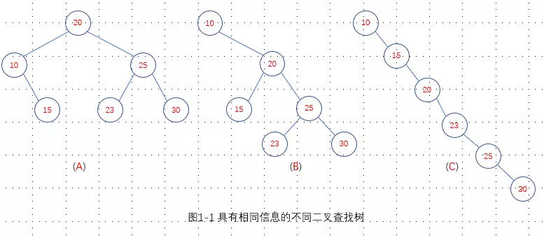
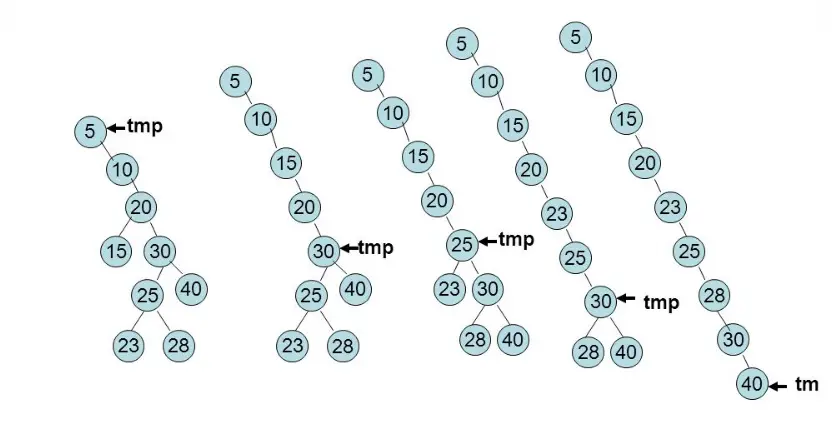
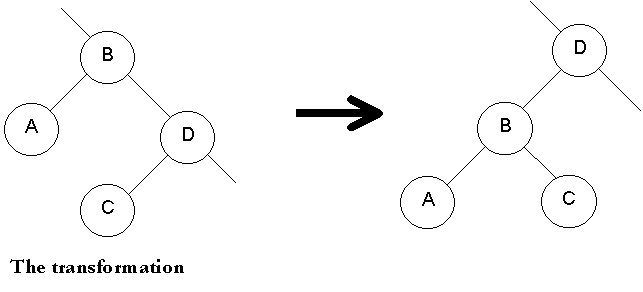
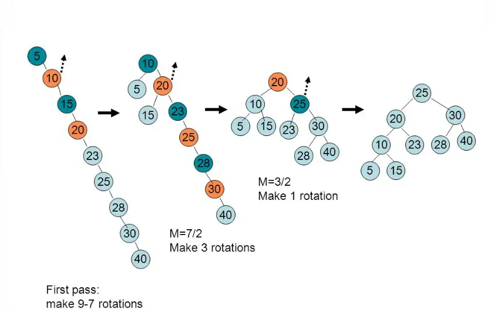

树适合于表示某些领域的层次结构（比如Linux的文件目录结构），使用树进行查找比使用链表快的多，理想情况下树的查找复杂度`O(log(N))`，而链表为`O(N)`，但理想情况指的是什么情况呢？一般指树是完全平衡的时候。哪最坏的情况是什么呢？就是树退化为链表的时，这时候查找的复杂度与链表相同。就失去了树结构的意义。所以树的平衡是非常重要的，这一节我们主要讨论树的平衡问题。


<u>如果树中任一节点的两个子树的高度差为0或者1，该二叉树就是高度平衡的。</u> 上图中，A是平衡二叉搜索树，B是不平衡的，C直接退化为链表了。

为保持树的平衡，有两种策略，一种是全局的，即当插入和删除操作完毕后，对树进行重建，全局调整树为平衡树；另一种是局部调整，即当插入或者删除导致树不平衡时就立即在局部范围内调整，使树保持平衡，这个是后面要讨论的AVL树。下面我们先讨论一下全局调整的方法。
### 有序数组创建二叉查找树
要想实现树的平衡，最简单的想法是我们可以设想一下将树的所有节点从小到大排序后，将中间值作为根节点，左侧的值作为左子树，右侧的所有值作为右子树，每个子树再按根节点的划分方法，以此类推，代码表示如下：
```c++
// data是排序后的数组
template<class T>
void BST<T>::balance (T data[], int first, int last) {
    if (first <= last) {
        int middle = (first + last)/2; //父节点，这种方法相当于一层一层的构造下一层子节点的父节点
        insert(data[middle]);       
        balance(data,first,middle-1);   //左子树再递归调用继续构造
        balance(data,middle+1,last);    //右子树再递归调用继续构造
    }
}
```
哪怎么得到有序数组呢？直接用排序算法排序？在二叉查找树中，这种方法比较笨，可以利用<u>二叉查找树的性质，中序遍历得到有序序列</u>。可以先对树做中序遍历，得到排序数组，再用`balance`进行平衡。
>为什么二叉查找树中序遍历得到有序序列呢？这和二叉查找树的定义有关，对于二叉查找树中的一个节点，其左子树的值小于该节点，其右子树的值大于该节点。而中序遍历是：左->中->右，这个顺序，刚好是从小到大的顺序。比如上图中的A、B、C三颗二叉查找树，只要是数据相同的二叉查找树，不管怎么排列，中序遍历的结果都是相同的`{10,15,20,23,25,30}`。

这种办法是比较笨的办法，代价比较大，等于是完全重新建立二叉查找树，有没有聪明一点的方法呢？下面DSW算法就是比较聪明的办法。
### DSW算法（Day–Stout–Warren algorithm）
主要思路：
- 先将任意的二叉查找树转化为类似于链表的树，成为主链或主干（backbone or vine）；
- 围绕主链中第二个节点的父节点，反复将其旋转，将这棵被拉伸的树在一系列步骤中转化为完全平衡的树；

#### 第一阶段：右旋转形成主链
其中涉及旋转（左旋转、右旋转）的操作，我们先看一下右旋转的逻辑，左旋转与右旋转对称，伪代码如下：
```c
/************************************************************************
 *  子节点Ch围绕父节点Par的右旋转
 *   Before      After
 *    Gr          Gr
 *     \           \
 *     Par         Ch
 *    /  \        /  \
 *   Ch   Z      X   Par
 *  /  \            /  \
 * X    Y          Y    Z
 ***********************************************************************/
rotateRight(Gr, Par, Ch)
    if Par不是树的根节点    //即Gr节点存在
        将Ch转作为Gr的右子节点（即，Gr作为Ch的父节点）
    Ch的右子树转作为Par的左子树
    节点Ch将Par作为右子节点
```

接下来开始DSW算法的第一阶段：创建主链：伪代码如下：
```c
// 创建主链，采用右旋转，将所有的左子树都旋转到主链上，最后形成一条右子树（单链形式）
createBackbone(root)
    tmp = root;
    while (tmp != 0) 
        if tmp有左子节点
            围绕tmp旋转该子节点；    //该左子节点将成为tmp的父节点
            tmp设置为刚刚成为父节点的子节点；
        else 
            将tmp设置为它的右子节点；
```
其过程如下图所示：

可以看到，右旋的过程就是不断把左子树旋转到主链的过程。

#### 第二阶段：左旋转转换为平衡树
右旋转形成主链后，下个阶段需要左旋转，我们看一下左旋转，分析思路与右旋转相同，下图中节点D围绕节点B左旋转，

```c
/************************************************************************
 *  子节点Ch围绕父节点Par的左旋转
 *   Before             After
 *    Gr                Gr
 *     \                 \
 *     Par(B)            Ch(D)
 *    /  \              /  \
 *   A    Ch(D)      Par(B) E
 *       /  \         /  \
 *      C    E       A    C
 ***********************************************************************/
rotateLeft(Gr, Par, Ch)
    if Par不是树的根节点    //即Gr节点存在
        将Ch转作为Gr的右子节点（即，Gr作为Ch的父节点）
    Ch的左子树转作为Par的右子树
    节点Ch将Par作为左子节点
```

通过右旋转形成主链后，开始第二阶段：主链转换为平衡树：伪代码如下：
```c
// 需要注意的是，每次顺着主链向下操作时，每隔两个节点，都围绕其父节点进行旋转
createPerfectTree
    n = 节点数；
    m = 2^[log(n+1)]-1； //计算当前节点数n与最接近完全平衡二叉树中节点数之间的差，多出的节点将单独处理
    从主链的顶部开始做n-m次旋转；   //从主链的顶部第二个节点开始，每隔一个节点进行左旋   
    while (m > 1)   // 上面单独处理的结束，开始下面的处理
        m = m/2;
        从主链的顶部开始做m次旋转； //从主链的顶部第二个节点开始，每隔一个节点进行左旋
```
过程如下图所示：


最开始，左旋转2次，之后进入while循环。进入while循环后，第1轮左旋转3次，第2轮左旋转1次，然后得出平衡树。最后还是要注意，是间隔1个节点围绕其父节点进行旋转（或者说是每次从主链根节点开始，偶数节点围绕奇数节点左旋转）。可以看到，左旋转就是不断将左右子树进行平衡的过程。

#### DSW算法源代码
代码见[dswtree.h](/dswtree.h)

>DSW论文：[One-Time Binary Search Tree Balancing:The Day/Stout/Warren (DSW) Algorithm](http://penguin.ewu.edu/~trolfe/DSWpaper/)